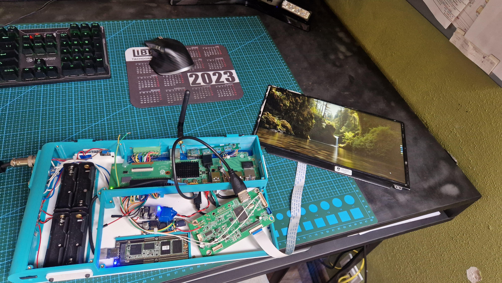
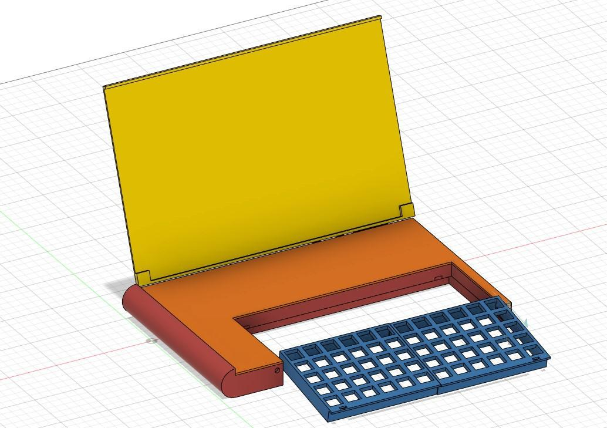
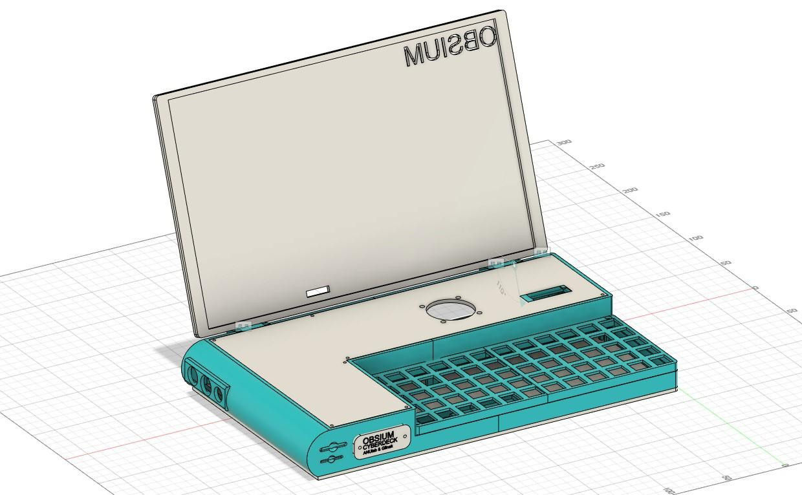
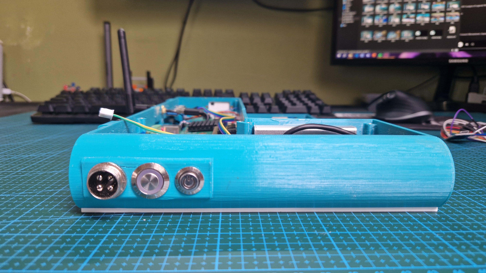
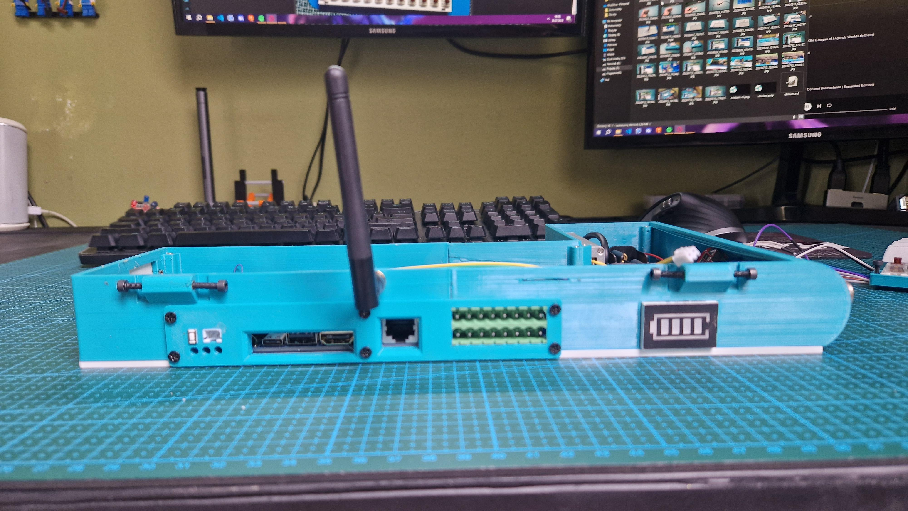
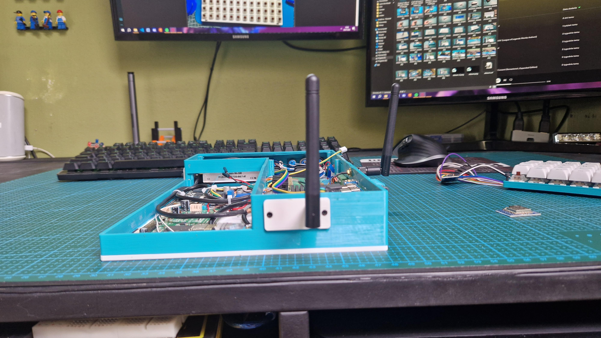
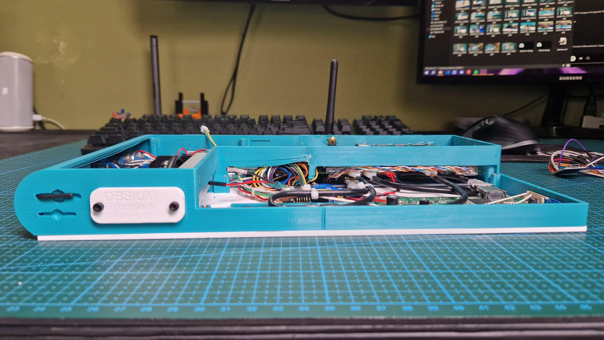
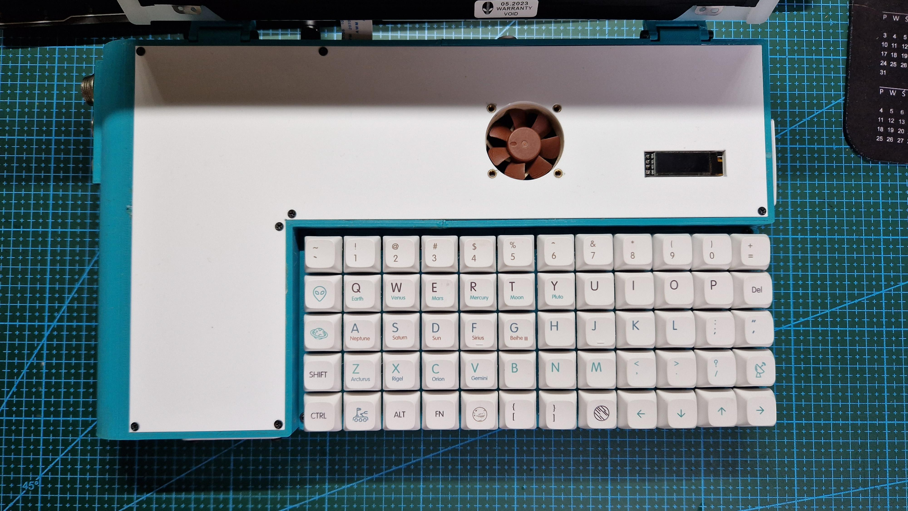
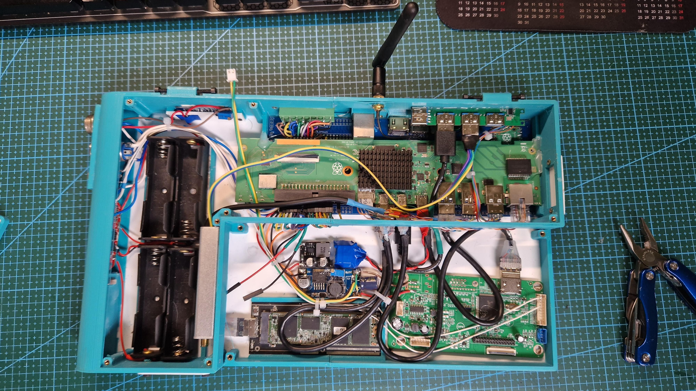
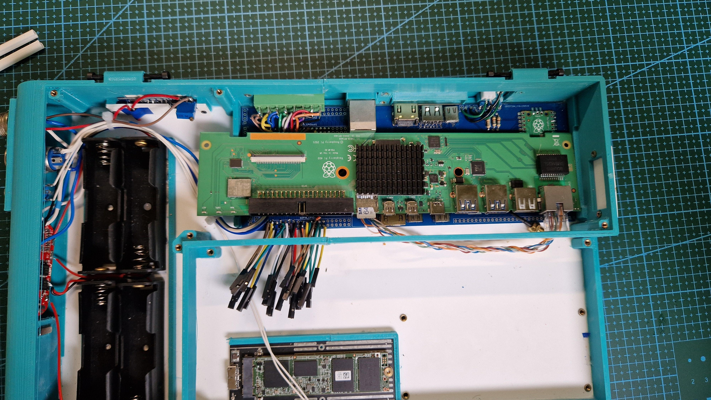

Cyberdecks serve a different purpose for everybody. Some create it purely for fun others try to make a perfect „laptop” like device to fulfil all of their needs. For me it is both.

## Links
* [Wallpaper](https://www.deviantart.com/mcfrolic/art/Abstract-Mountain-Wallpaper-462151732)
* [Hackaday.io page](https://hackaday.io/project/192016-the-obsium-cyberdeck)
* [Hackster.io's article](https://www.hackster.io/news/the-obsium-cyberdeck-is-a-custom-workhorse-d616fb3cd419)
* [Cyberdeck Cafe's website](https://cyberdeck.cafe/)
* [Cyberdeck Cafe's discord](https://discord.com/invite/JK76KBsfuR)
* [yarh.io - the keyboard design](https://yarh.io/)

## But why?
Let's start with a little bit of story behind creating Obsium. It's not my first deck, in fact it's my 8th deck. But why make so many isn't it easier to buy a laptop? - you may ask.
Yes it is but the reason for building decks for past 2 years and spending all my money on it was to built something that fits all MY needs and maybe learn something while doing it. So i decided that my last deck has to have:
- a big-ish battery
- exposed gpio
- my digital oscilloscope
- LoRa (Long Range messenger)
- sdr
And it has to be flexible. All my previous decks have failed at at least one of this points. But now I've a deck with all that features (not all i wanted at the beginning but all I mentioned). Yes it's big and Yes laptops are more powerful and I probably could have got away with just taking an additional Arduino with me all the time but i am a masochist that has a 3d printer and some skills. 

## Fusion360 go brrrrr
Designing process wasn't as easy as i have hopped. What i have right now is the second version of Obsium. The first one was cooler but not practical at all. So in the middle of printing and designing I scraped everything and started all over again. I have hoped that my last deck would be thinner but i didn't want to order another PCB and wait another month. Besides that current design incorporates (in my opinion) everything pretty well. 

*old design*

*new design*

## I need more I/O
On the left side I have charging port for my custom charger, main switch to power Obsium on and a button to turn on and off the display. 

The back side has one battery indicator, antena for LoRa and one removable panel with ports and gpios. 

The right side has a fan switch and is going to have an antena for 100MHz-1GHz SDR 

And finally the front, It has a label and 2 Allen keys 

Looking at it from the top you can see a fan, an offset keyboard and a small, not even 1inch LCD.

A huge time saviour while making Obsium turned out to be using plexi for everything large and flat. It also made Obsium really rigged although i won't throw it around. 

## The inside
The inside might look, at first glance, as one big mess but It's actually a well organized and thought through arrangement of cables. Another huge savior is the PCB I'm using cause it allows for a lot of connections (just like every PCB...) without any extra mess. Although if I could turn back time I would do It differently, sadly from the back ports only the Ethernet is working. Theoretically HDMI is also working but, there has to be some lose connection cause it sometimes lacks a few colors. Also the USB is working but as 2.0 and not 3.0. I don't know why the ports have failed, I have checked all of them before putting this board inside but It still managed to break itself. Now I have to live with that. 

## Specs
Obsium is powered by a rather unusual raspberry pi 400 board with a M.2 SSD connected via USB 3.0. Powering everything is battery pack made out of 4 Li-ion cells in 4s configuration giving around 40Wh and 16.8V. As a keyboard Obsium is using custom made ortholinear design and configuration by yarh.io but with a few tweaks.  

## Last words
For the next few weeks i'm going to be debugging this deck. I have to check GPIO's, LoRa, oscilloscope (that's what the Raspberry Pi Pico is for), SDR and the mini LCD. I would also like to thank Cyberdeck Cafe discord members and my discord friends for all the support and help with making this deck. 