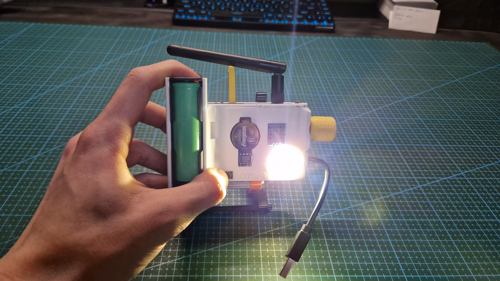
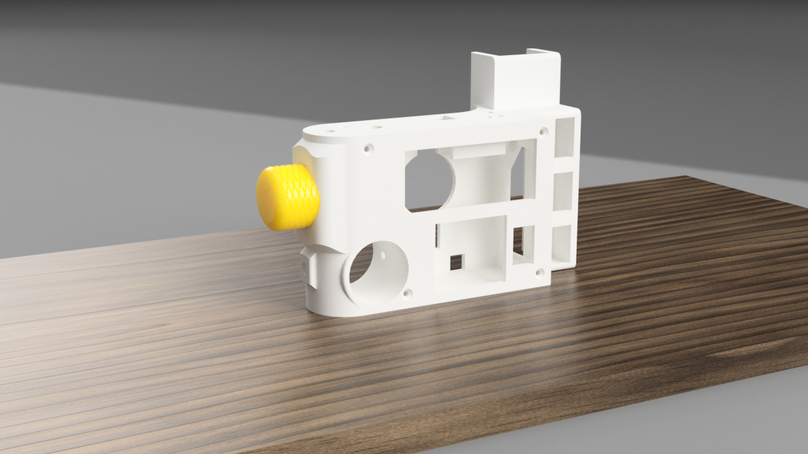
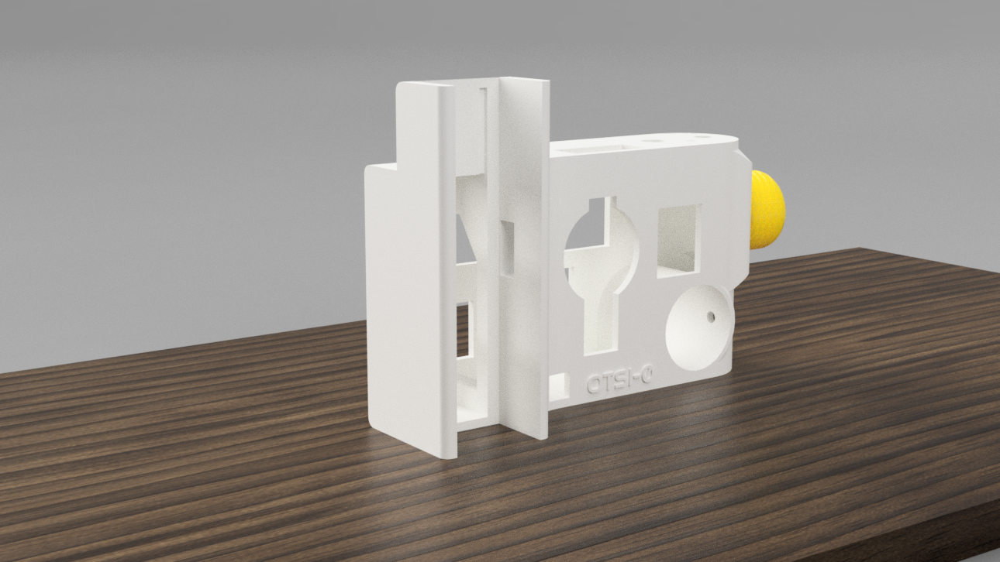
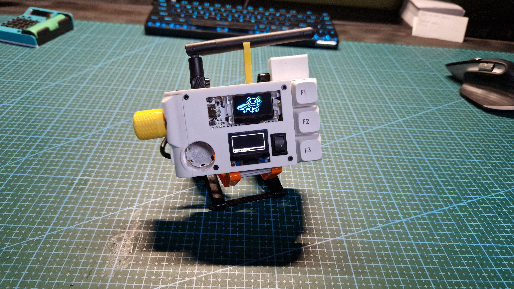
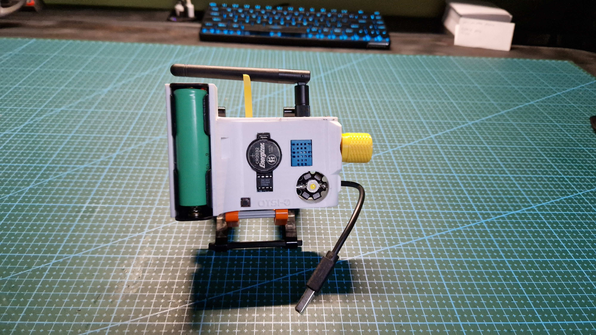
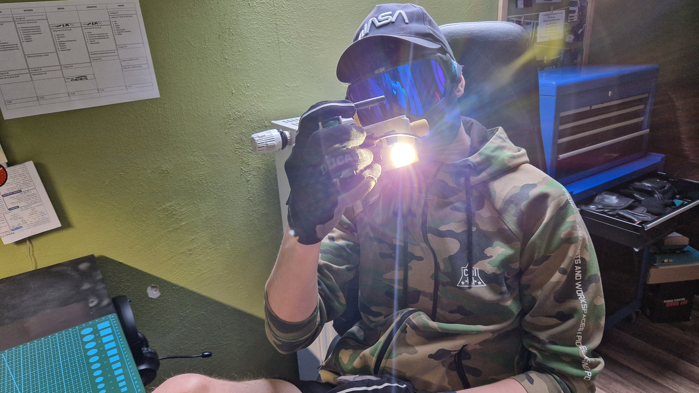

Otsi is a winning design of a cyberpet made for Cyberdeck Cafe's contest. Main objective of this contest was to build your personal companion that would need to be taken care of and would serve a real life purpose like helping you with everyday tasks.


**Warning!** Otsi mk1 is no longer under development. There is mk2 coming in the early 2025
   


## Links and credits
This project wouldn’t have been possible without the awesome Cyberdeck Cafe community
* [Cyberdeck Cafe's website](https://cyberdeck.cafe/)
* [Cyberdeck Cafe's discord](https://discord.com/invite/JK76KBsfuR)  

Otsi's graphics are based/inspired by witch's design. [Original axolotl graphics by witch](https://dinopixel.com/purple-axolotl-pixel-art-17015)  
Main menu is made to look like flipper zero's menu, the code is based on upiir's work. Link to the [Github Page](https://github.com/upiir/arduino_oled_menu)

## Meet Otsi
### Story
As with every great project this one also started as a contest from Cyberdeck Cafe. In September of 2023 the announcement was made that a contest for a cyberpet is being hosted. We got only a few requirements so we could unleash our creativity. And mine went like crazy. After a few months of hard work, I submitted my design and won!

### Functionalities
For me cyberpet should be your personal helper, just a friendly pet taken with you everywhere that can help you with your everyday tasks. Because I'm more into programming and electronics, Otsi was supposed to have a built- in multimeter, flashlight,  calculator and more. Not every idea became reality but that's where Otsi mk2 comes in, more about it later. So what are the features of Otsi at the moment you might ask. So the functionalities are:
* Thermometer and hygrometer
* Built-in 3W LED
* Timer and stoper
* RTC module
* wifi scanner

There are a few not completed functionalities like:
* a calculator
* lora communication
but they are not gonna be added. Maybe after creating mk2, but with huge MAYBE

### Otsi's "emotions"
Otsi sleeps between 10pm and 6am, you can interrupt her but I wouldn't advice doing that. Besides that she needs to be taken care of, exposed to sunlight. Also Otsi is a little attention queen so make sure to give it to her. If any of the stats drop below predefined threshold she will start being less and less responsive, tired and unhappy. To calm you, she can not die, Otsi can just be exhausted.

### Design
After having the code like 90% completed i started working on the design. As you can see from the photos, It is quite unique.
 *Render front*
 *Render back*
This design was made so that you can comfortably hold Otsi with your right hand and operate the encoder with your left hand.

## Creating your own

**Warning!** Otsi is not a beginner friendly build. You have to have a lot of patience and soldering skills.

To create your own Otsi, follow the instructions provided in [Otsi's github](https://github.com/A-N-Ulab/OTSI-cyberpet).

## Know problems
The one problem that I managed to find is that the timer doesn't work correctly countdowns above a few minutes. It will be fixed with mk2

## Last words
Otsi has been a great project to vastly improve my arduino coding skills. This project wouldn't have been possible without the awesome people from Cyberdeck Cafe. Especially Helix.

**Stay creative and keep improving**\
**~Simon**

