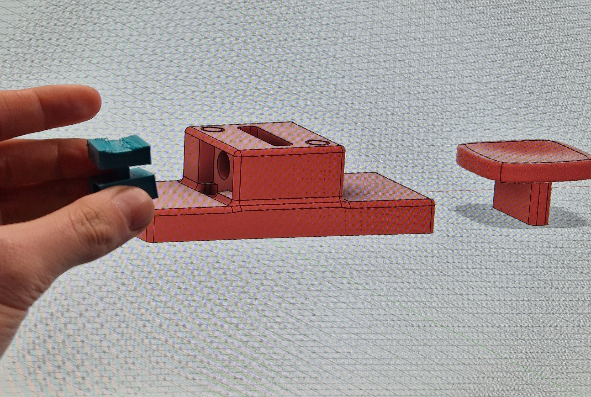
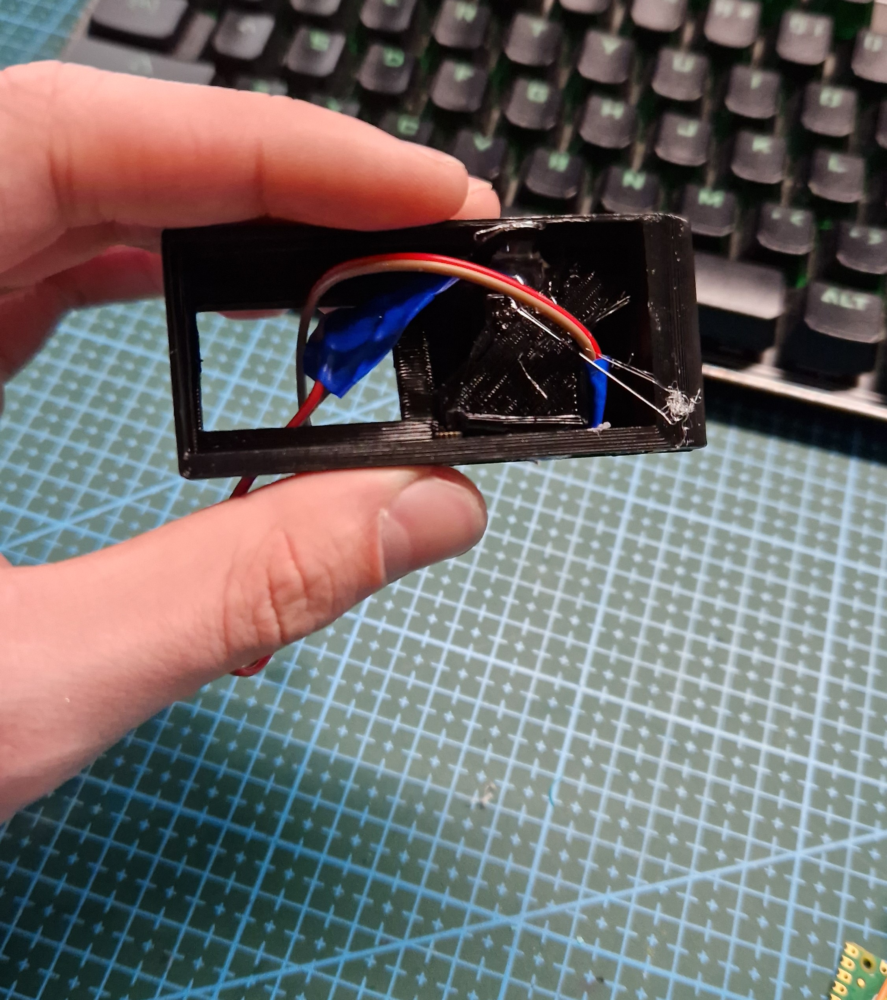
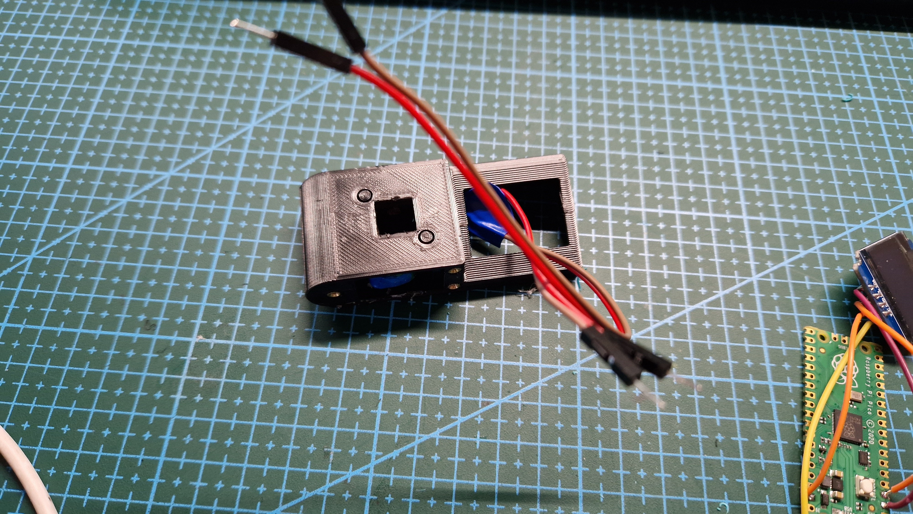
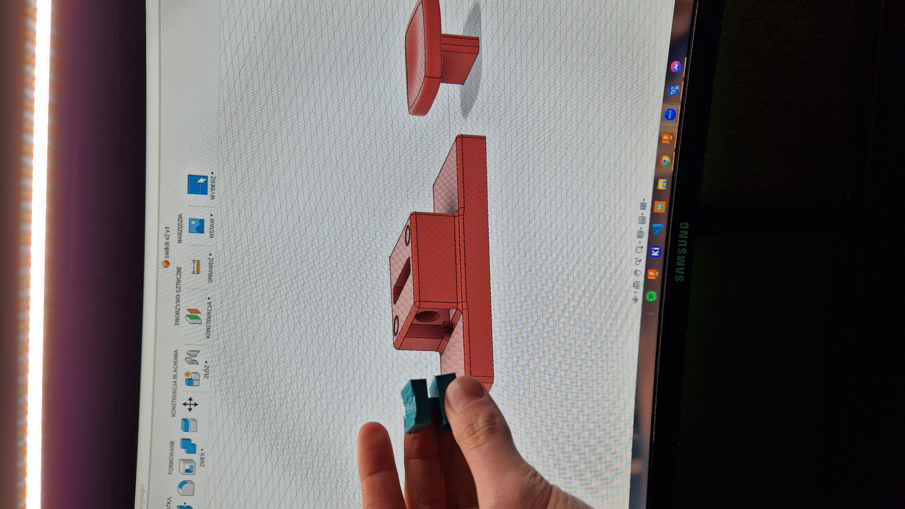
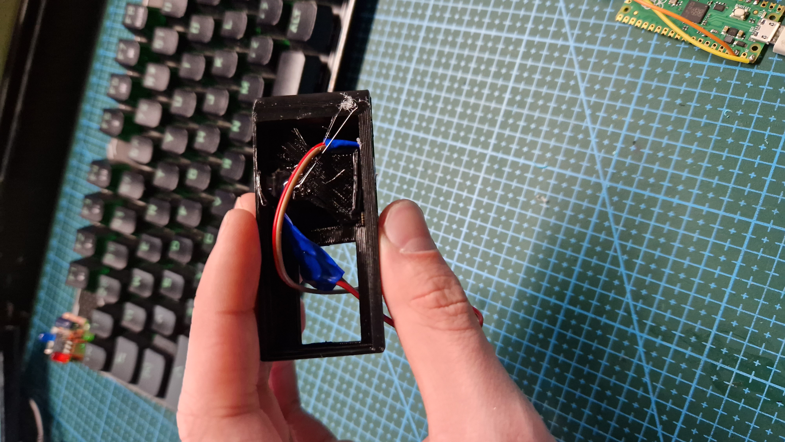
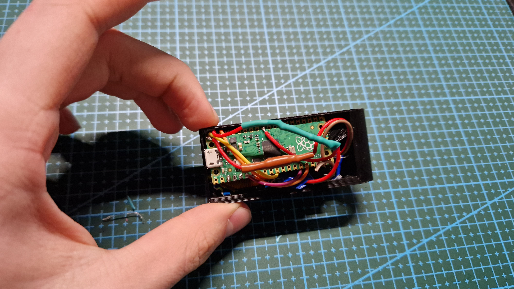
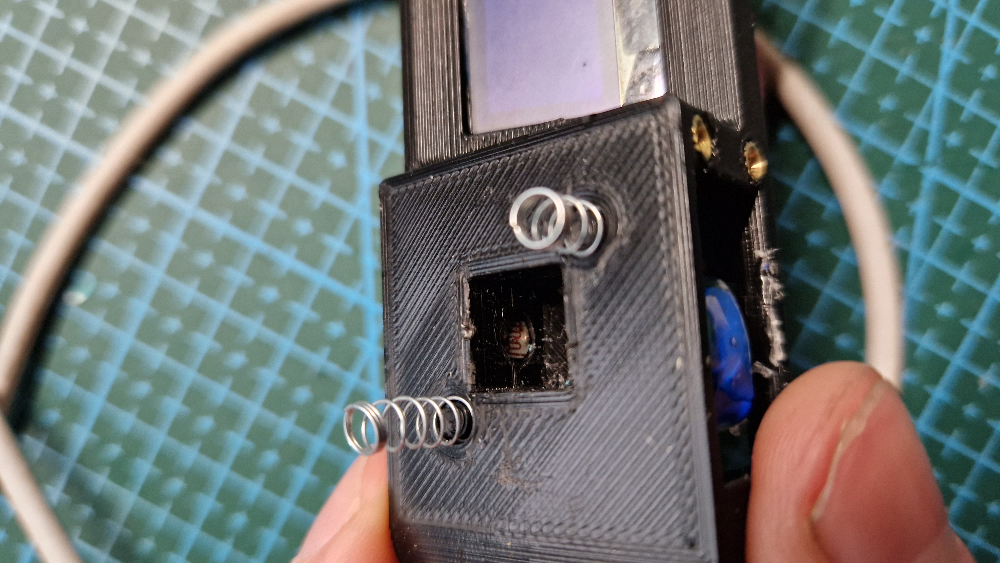

This is yet another project made for a contest hosted by Cyberdeck Cafe. The objective was to create a keyboard that, as the name suggests, has only one button. Everything else was up to you.


**Warning!** This project is no longer developed    
     

* [Cyberdeck Cafe's website](https://cyberdeck.cafe/)
* [Cyberdeck Cafe's discord](https://discord.com/invite/JK76KBsfuR)

## Creation process
This project took a few weeks which is relatively quick considering the fact that It was built after school and other activities. Tbh I don't know why I have decided to make It, I have never actually used it besides while testing it for the contest. 

## How it works
One-key keyboard (or okk. for short) works by measuring how much light is emitted by the LED onto a photoresistor, while the `key` is not pressed, the LED is not covered so all the light can shine onto the photoresistor. But when it is pressed by some amount, the `key` starts blocking some of the light so the photoresistor's resistance changes. And when this photoresistor is connected with another one, and voltage divider is created by them. You can measure this resistance difference (or, to be more accurate, now a voltage drop) with arduino's analog pin. The code can be as short as just a few lines. Additionally I have added another screen, cause It makes okk. look better and also everything nowadays has to have a screen.

## Make your own
Why would you even want to make your own version? Never mind... Good-ish documentation can be found on okk.'s github page. Link above.

## Gallery

  
  
  
  
  
  
  


**Happy making**\
**~Simon**