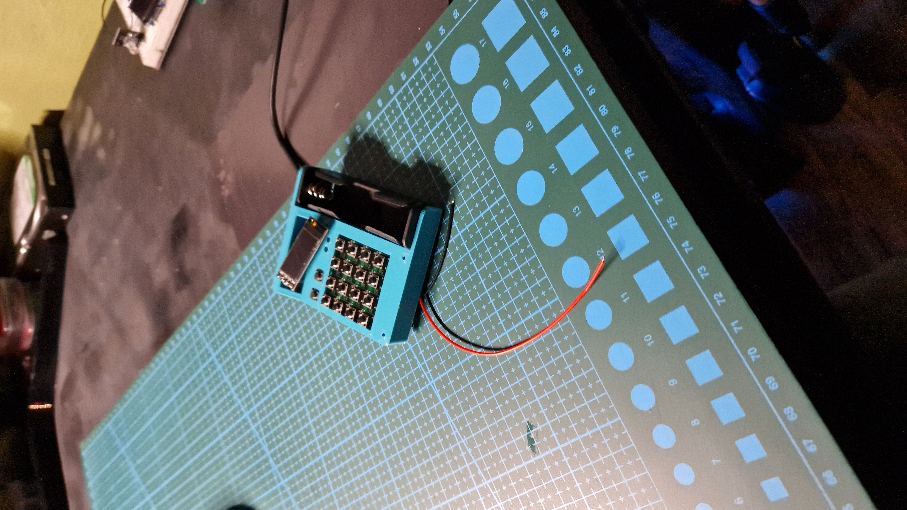
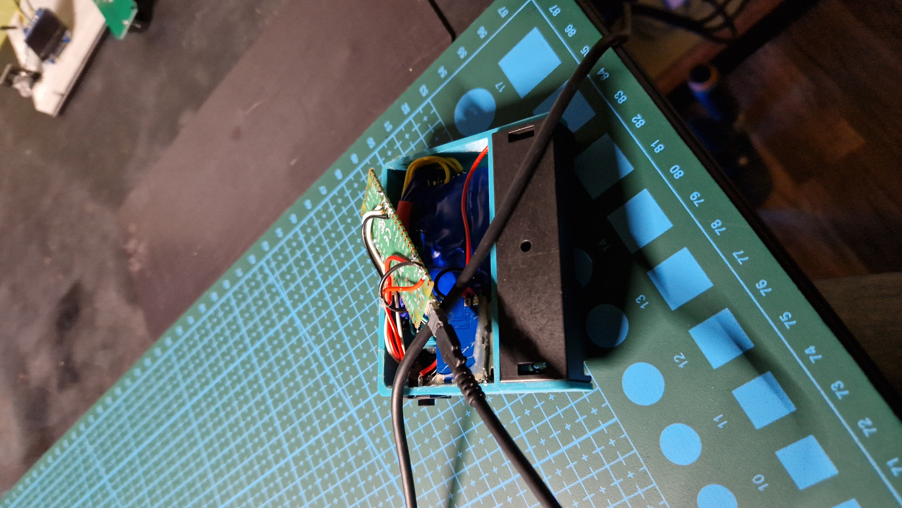
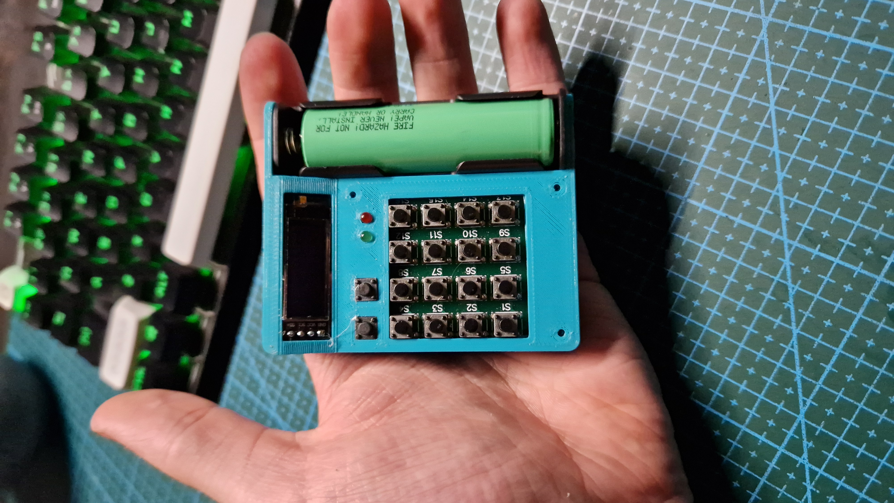

Atrovel calculator is a project that originated from one of my schools lessons. We were learning how to use 4x4 button matrix and bored Simon decided that it would be a great idea to make a simple calculator.


**Warning!** This project is no longer developed    
     


## Story
It all started at one of my technical lessons. We were learning arduino's for a while at that moment. And that day's assignment was learning how to read from a 4x4 button matrix. I, knowing a little bit about arduino, was bored a little bit. So to keep myself "entertained" I started work on a calculator. Nothing serious, not even doing real calculations, just displaying equations on a serial monitor. But then. after 3 hours of making it, I started to wonder. Could I make an actual calculator? I had to know. The same day, after coming back home, every other project went aside and work on this calculator began. My style of working on projects like this is splitting them into two main tasks: programming and case/electronics. And, as always, programming went first. Atrovel's code might be a little bit rough around the edges, and not optimized as much as I would like. Despite that it works. I would even dare to say that It works quite well. Anyways, after a week of coding and debugging. The code was done and now I had to start working on the enclosure. My first idea was using MX cherry switches but after 5h long print this case turned out waaaaay too big. So I decided on using the original 4x4 button matrix with two additional ones. After stuffing all the electronics inside and closing It with a little amount of force (jk, a lot of force...) and super glue, came the time to test It. And oh boy have I tested It. One month of using it in school while doing math and physics exams. And all the calculations were correct.

## Problems
There are two main problems with Atrovel. The buttons are kinda shitty, and you have to remember the layout. Another thing is that you are unable to calculate e.g. 2+2 and then make a square root of it. You have to type 4 and then press square root. Will I fix those? Probably not. But Atrovel's spaghetti code will probably be used in another iteration of Otsi

## Making your own
To create your own Atrovel, just follow the instructions on It's github (link above). If you decide to make your own, I hope it will serve you well. And if you want, you can send your finished calculator to me. I would be delighted to see It

## Gallery

  
  
  


**Stay creative**\
**~ Simon**

