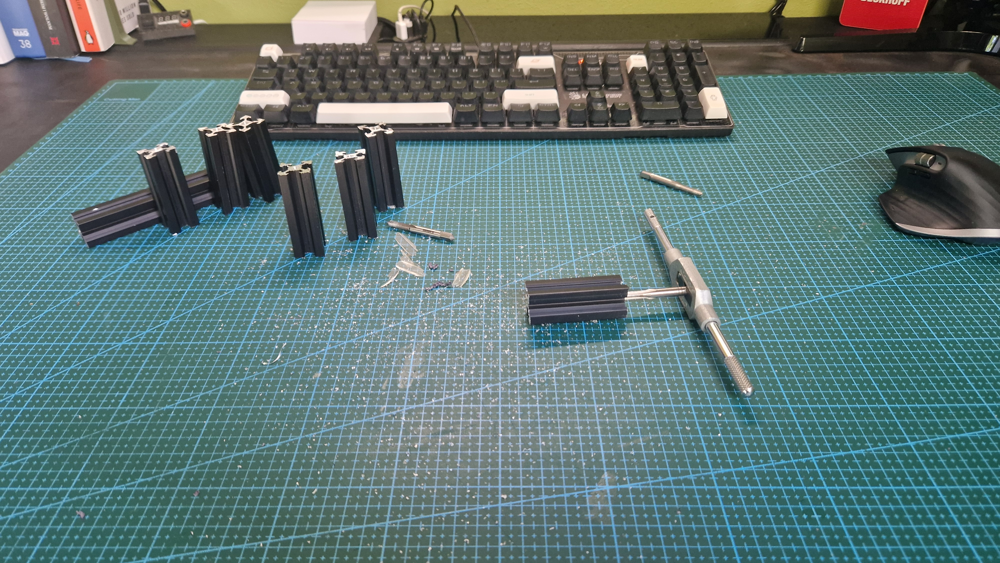
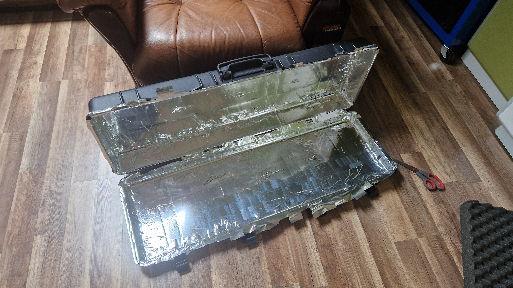
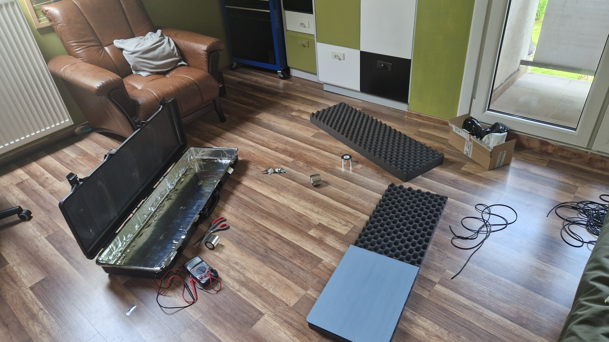
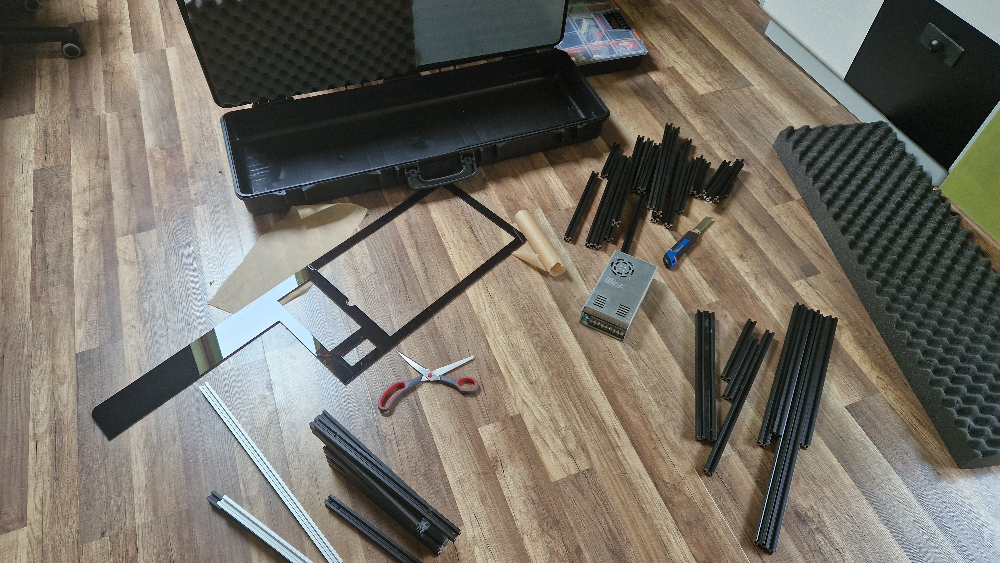
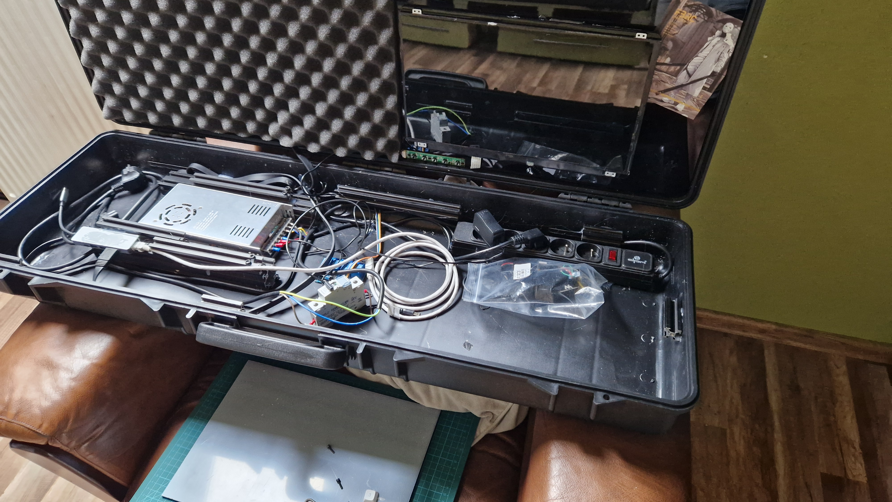
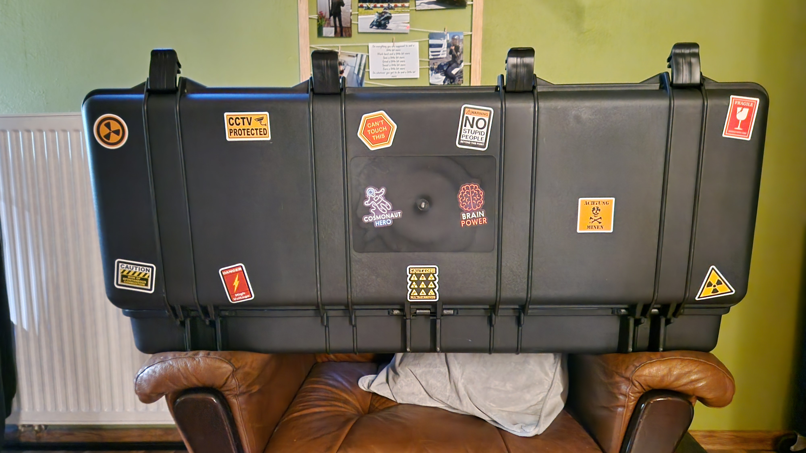
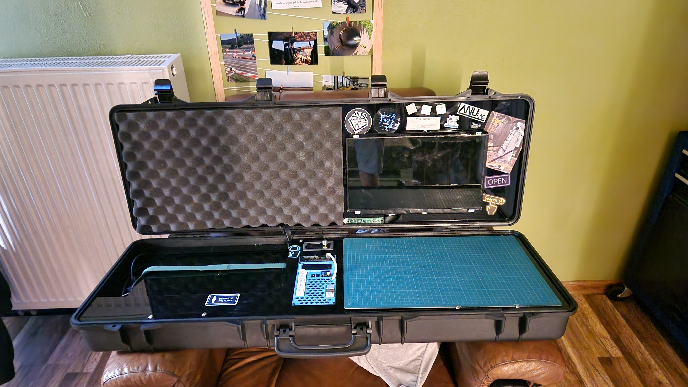

This is a 15kg pelican case that houses lab bench power supply, ethernet switch, second screen, charger for my laptop and much more. Also It's incredible durable thanks to using a gun hard case.

## But why?
In september of this year (2024), I will be attending a hackathon. So I decided that It will be a great excuse for building this 15kg monstrosity. Also, I wanted my own workstation like this since like 2 year but never had a great enough reason to build it.

## Creations process
Every creation process starts with two things. Searching for inspiration and a lot of money spent. To be transparent, I just call It a Pelican Case, It's not a Peli case. Those are too expensive, what I'm using is some noname suitcase for a gun. After my 5mm acrylic arrived I started cutting V-slots to hold everything together inside the suitcase. And I have to say. Tapping 10 holes was a PAIN. It took me like 3 hours and my hands were completely destroyed.

Oh, I forgot to mention that It was meant to be EMP proof, but I learned the hard way that this so-called "aluminum tape" is not conductive at all. It was after covering the whole case in It...

## Functions
### Second monitor
There is a second 15ish inch screen that serves as a second monitor.

### Power supply
A 300W 24V power supply taken from my old Ender 3 and a regulated power supply (1.5-36V)

### Ethernet switch
5 port one gigabit ethernet switch

### Other
The whole case is controlled by Arduino Nano and some relays. Most important data, like the temp of the power supply is displayed and too beautiful mx cherry switches are used to control everything. Also a 16A breaker is installed, It's also a power switch.

## Last words
It looks simple bc It is. But the size of it made it a nightmare to assemble. That's why it took me 2 months to finish It. Will see if It works as I want in one month, during the hackathon.\

**Never give up**\
**~Simon**

## Gallery

  
  
  
  
  
  


